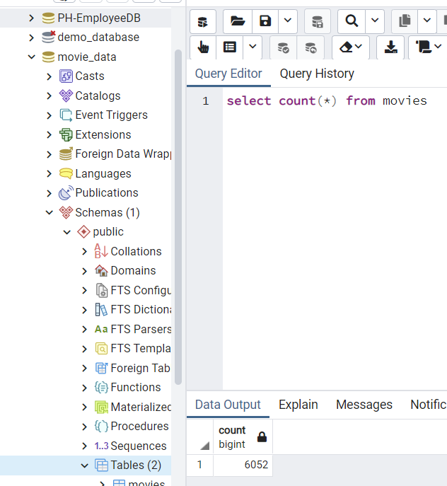
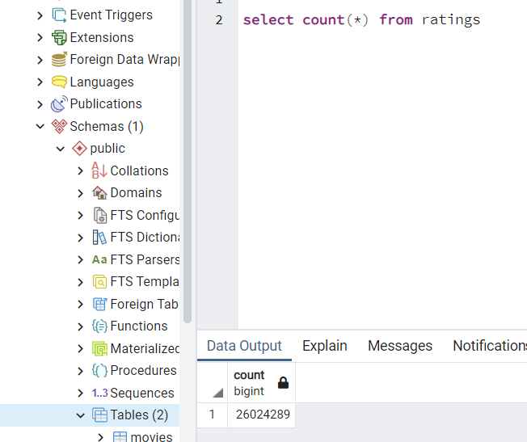

# Movies-ETL
## Overview
This project extracted movie and rating data in CSV and JSON formats into pandas, transformed the data, and joined it. Then the data was loaded back into pgAdmin tables. 

 

